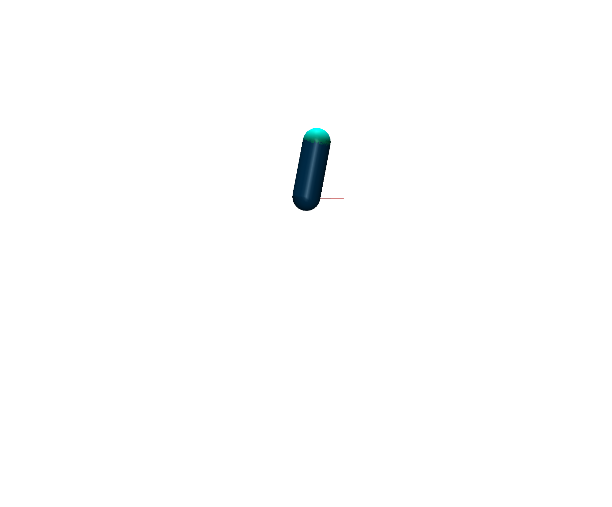
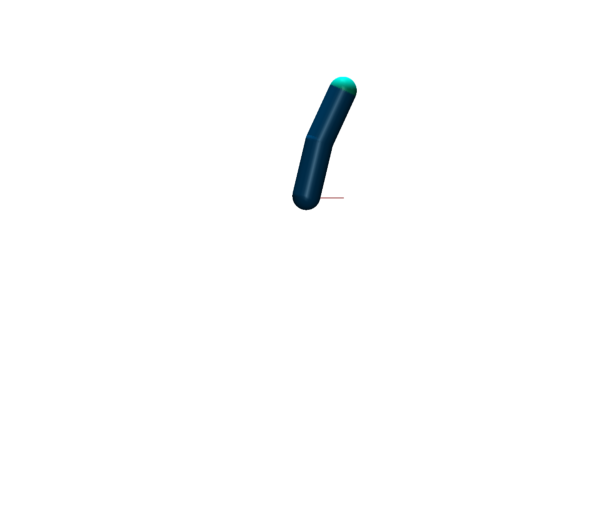
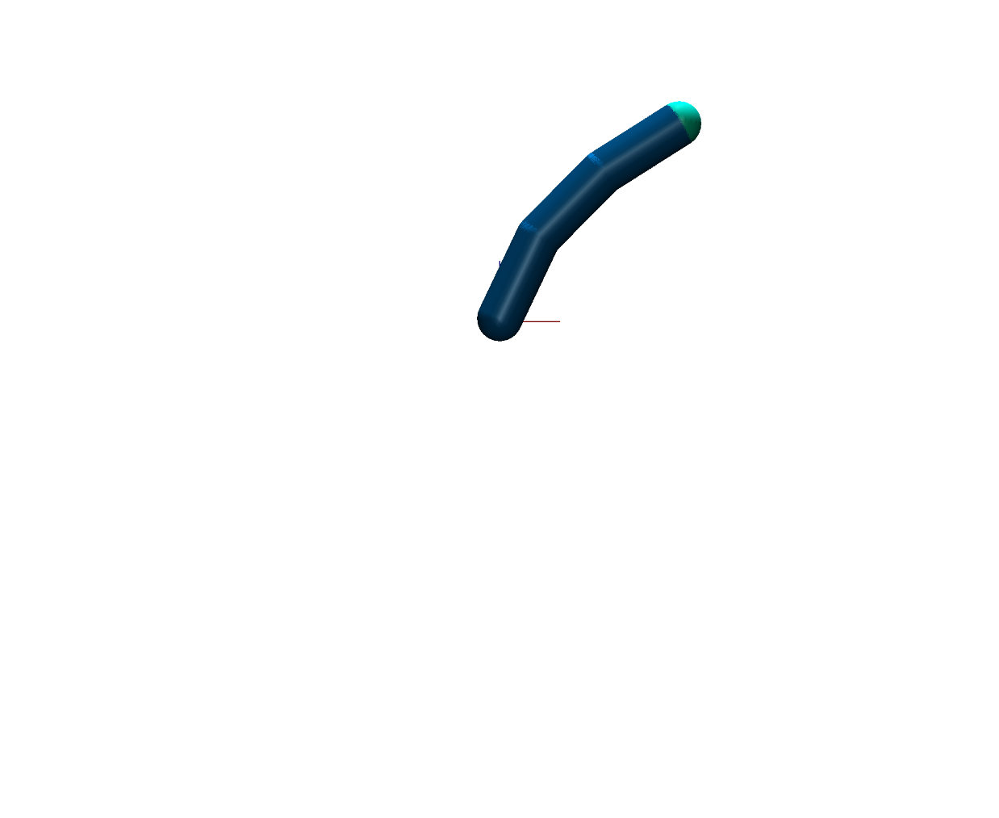
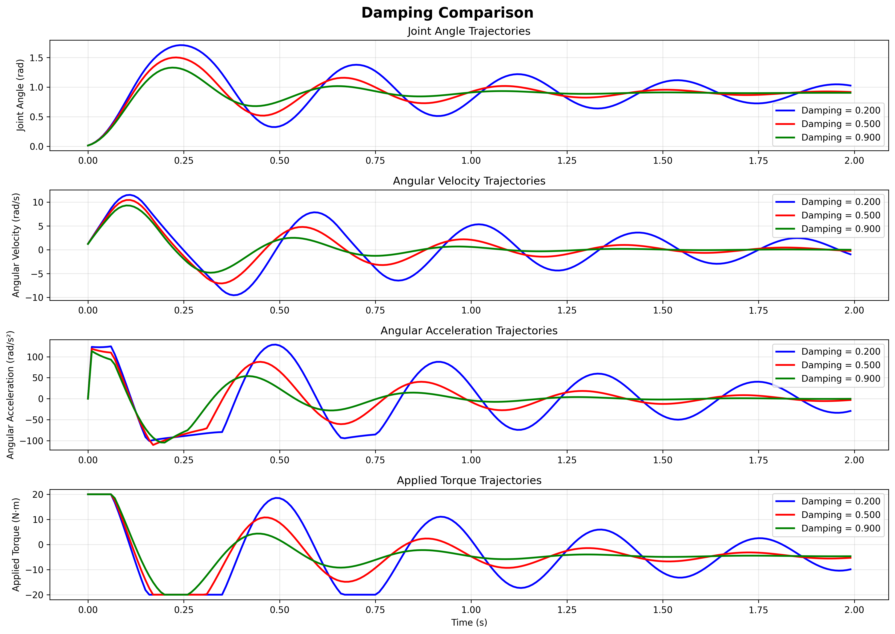
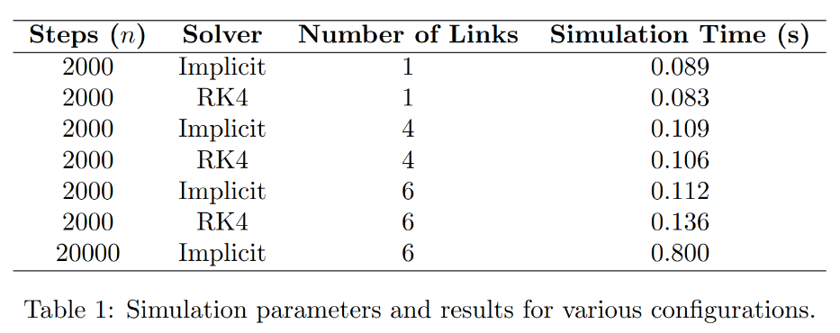
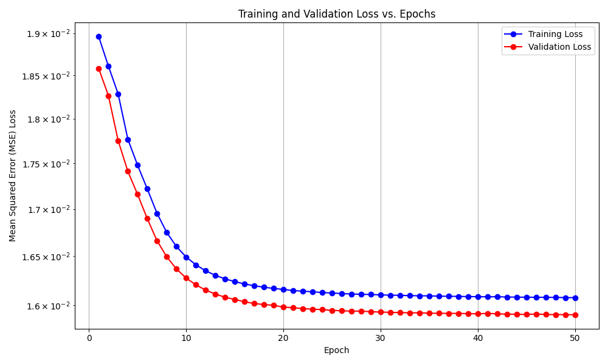
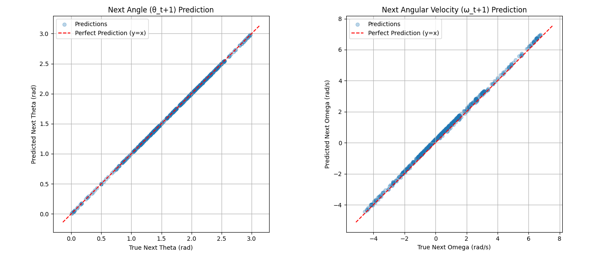
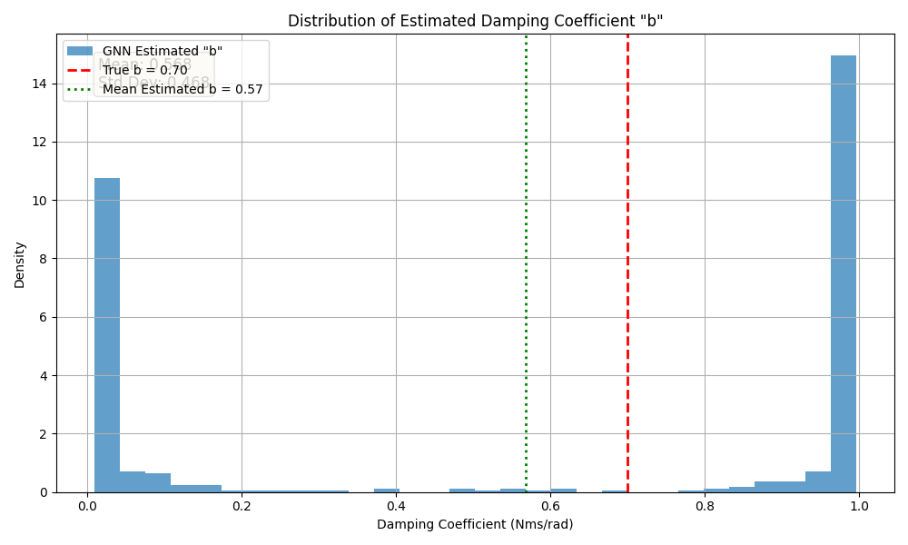
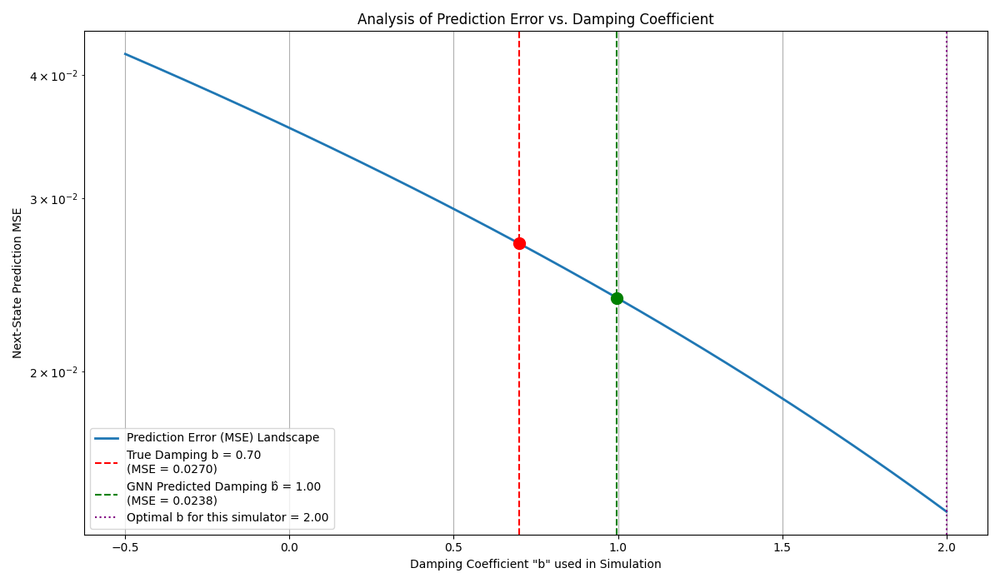

# GNNSys Id: Learning Physical Parameters from Motion Using Graph Neural Networks for Robot Control
## 1. Introduction 

Robots frequently encounter unpredictable internal mechanics like friction and micro slip, which are hard to model and harm performance. Instead of manual calibration or external sensors, this project uses simulation based Graph Neural Networks to identify internal dynamics from motion data in a self supervised manner, efficiently addressing our limited computational resources.


## 2. MuJoCo Simulation System

MuJoCo was chosen for its computational efficiency, broad use in the reinforcement learning community, and smooth integration with the JAX framework. Its performance and flexibility make it ideal for robotic simulation and trajectory generation, as noted in recent reviews ([Kaup et al., 2024](https://arxiv.org/pdf/2407.08590.pdf)).


### 2.1 Modular N-Link Architecture

The simulation framework employs a **parametric design approach** that automatically constructs n-link robotic manipulators based on configuration parameters. This modular system allows for:

- **Scalable Design**: Automatically generate 1-link to n-link configurations
- **Parameter Studies**: Systematically analyze how damping, friction link count etc. affects the trajectory

<div align="center">
<table>
<tr>
<td align="center"><br><b>Single-Link Manipulator (1-DOF)</b></td>
<td align="center"><br><b>Two-Link Manipulator (2-DOF)</b></td>
<td align="center"><br><b>Three-Link Manipulator (3-DOF)</b></td>
</tr>
</table>
</div>


### 2.2 Parametric Design Apporach
With the model setup several parameters such as inertia, mass, damping, friciton, gear ratios, maximum applied torque can be defined.

### 2.3 Damping Effect Analysis
In the later GNN our goal was it to estimate the damping of the generated robot setup. To validate that a proper damping estimation is crucial for predicting the system response an identical physical 1-link simulaton was performed under varying damping parameters.

#### 2.3.1 Experimental Setup
The following specifications were used for the damping analysis:

**Physical Properties:**
- **Mass**: 3.0 kg (main link body)
- **Fingertip Mass**: 0.5 kg (end effector)
- **Link Length**: 0.3 m
- **Link Radius**: 0.075 m
- **Moment of Inertia**: 0.159 kg⋅m²

**Dynamic Parameters:**
- **Friction Coefficient**: 0.0 (frictionless joints)
- **Torque Limit**: 20.0 N⋅m (maximum actuator output)

**Simulation Configuration:**
- **Time Step (dt)**: 0.01 s
- **Gravity**: [0.0, 0.0, -9.81] m/s²
- **Solver**: Implicit integration method
- **Simulation Duration**: 200 steps (2.0 seconds)

**Control Parameters:**
- **Proportional Gain (Kp)**: 40.0
- **Derivative Gain (Kd)**: 0.1
- **Control Type**: PD Controller

#### 2.3.2 Results
##### Damping
The following figure illustrates how different damping values significantly influence the system's response and settling behavior:
<div align="center">
<table>
<tr>
<td align="center"><br><b>Damping Effect on 1-DOF Manipulator Trajectory</b></td>
</tr>
</table>
</div>
The trajectory comparison clearly demonstrates that:

- **Higher damping** results in more conservative, slower convergence with reduced overshoot
- **Lower damping** produces faster response but with increased oscillatory behavior
- **Intermediate damping** values provide balanced performance between speed and stability

##### Sim-time
The simulation results demonstrate that data points can be generated efficiently without requiring high-end hardware.
The plot illustrates the computation time needed to simulate data points on an Intel i5-8350U CPU with 4 cores.
<div align="center">
<table>
<tr>
<td align="center"><br><b>Damping Effect on 1-DOF Manipulator Trajectory</b></td>
</tr>
</table>
</div>

#### 2.3.3 Data Generation Strategy

The Data Generation Pipeline used for this project can be split down into the following:

1. **Systematic Parameter Variation**: Generate varying trajectories the same physical setup (inertia, damping, etc.) with different initial conditions and PD controller values
2. **State Trajectory Recording**: Capture complete system state evolution (position, velocity, acceleration, torque)

### 2.4 Automatic Generation Pipeline

The system features an **automated XML generation pipeline** that:

1. **Parameter Input**: unique physical robot specification, varying controller and initial condition setup  
2. **XML Construction**: Automatically builds MuJoCo model description
3. **Mujoco Simulation**: Executes Simulations based on XML file and varying controller and initial condition setup 
4. **Data Logger**: Save the Trajectories and specifications as JSON files


**Code Architecture**:
```
Parameter Space → XML Generation → MuJoCo Engine → PD Control → Data Export
    ↓               ↓              ↓              ↓           ↓
• n-links       • Dynamic      • Physics      • Torque    • JSON
• Masses        • Geometry     • Integration  • Limits    • Metadata  
• Damping       • Joints       • Constraints  • Tracking  • Trajectories
• Controllers   • Actuators    • Rendering    • Response  • Parameters
```


### 2.5 Debugging

- **Flexible Render Modes**: Execute simulation in visual mode for trajectory inspection and physical plausibility validation, or headless mode for rapid automated testing and data generation
- **Accelerated Validation**: Speed up simulation playback to quickly assess trajectory behavior and validate parameter configurations across longer time horizons


### 2.6.Future Work

#### 2.6.1 Intelligent Data Collection
- **Trajectory Quality Assessment**: Automatically evaluate data richness and truncate trajectories at steady-state
- **Richness Metrics**: Implement measures for state space coverage, frequency content, and control effort diversity

#### 2.6.2 Realistic Signal Modeling
- **Sensor Noise**: Add realistic jitter to position, velocity, and torque measurements
- **Communication Effects**: Include delays, sampling limitations, and actuator response characteristics
- **Signal Processing**: Model discrete-time effects and filtering artifacts

#### 2.6.3 Advanced Physical Models
- **Enhanced Damping**: Non-linear damping models
- **Comprehensive Friction**: Stiction, Stribeck Model
- **Gear Train Effects**: Backlash

#### 2.6.4 Data Pipeline Improvements
- **Active Learning**: Intelligent parameter space exploration
- **Real-time Monitoring**: Online trajectory quality assessment


### 3. GNN Design

This section details our approach to identifying physical parameters of robotic systems using Graph Neural Networks (GNNs). Our goal is to predict latent parameters, such as joint damping coefficients, by learning to predict the system's dynamic response in an unsupervised, end-to-end manner.

### 3.1 Introduction to GNNs for Robotic Systems
GNNs are a class of neural networks specifically designed to operate on data with graph structures. This makes them inherently suitable for robotic systems, particularly articulated robots, where joints and links form a natural graph.

#### 3.1.1 Rationale for Using GNNs
Robotic systems like manipulators or legged robots can be represented as graphs:
-   **Nodes:** Represent joints or links of the robot.
-   **Edges:** Represent the physical connections or kinematic constraints between these components.

The advantages of GNNs for modeling such systems include:
-   **Permutation Invariance/Equivariance:** GNNs can process graph nodes in any order, which is suitable for robotic systems where the labeling of components might be arbitrary.
-   **Variable Structure:** They can adapt to graphs of varying sizes and topologies, making them applicable to robots with different numbers of links or configurations.
-   **Parameter Sharing:** GNNs typically share weights across nodes and/or edges, promoting generalization and reducing the total number of learnable parameters, which is beneficial for data efficiency.
-   **Local Information Aggregation:** GNN layers iteratively aggregate information from neighboring nodes. This allows the model to learn how local physical interactions (e.g., forces and torques at a joint) propagate and influence the overall system dynamics.

These properties make GNNs a promising tool for system identification, where the goal is to understand the interplay of forces and motions across interconnected components based on observed data.

#### 3.1.2 Graph Convolutional Networks (GCNs)
In this project, we utilize Graph Convolutional Networks (GCNs) [^1], a popular and effective type of GNN. A GCN layer updates the feature vector of each node by aggregating feature vectors from its neighbors, followed by a linear transformation and a non-linear activation function. For an $L$-layer GCN, each node's final representation effectively incorporates information from its $L$-hop neighborhood, allowing it to learn complex relationships based on local and extended connectivity.


### 3.2 Methodology: GNN for Damping Coefficient Estimation

The primary objective of this GNN module is to estimate the physical parameters of a robotic system. For the scope of this project, we focused on estimating the viscous joint damping coefficient ($b$) of a 1-link pendulum system.

**Unsupervised Learning Paradigm**

We employ an unsupervised learning strategy. The GNN is not directly provided with the true damping values during training. Instead, it learns to infer these parameters implicitly by minimizing the error in predicting the system's next state. The process is as follows:

1.  **Input:** The GNN receives the current kinematic state of the system for each joint $i$: its angle $\theta_{t,i}$ and angular velocity $\omega_{t,i}$.
2.  **GNN Output:** The GNN processes these inputs and outputs an estimate of the latent physical parameter for each joint, in this case, the estimated damping coefficient $\hat{b}_i$.
3.  **Differentiable Simulation:** This estimated parameter $\hat{b}_i$ is then fed into a differentiable physics simulation step along with the current state $(\theta_{t,i}, \omega_{t,i})$ and other known physical properties (mass, inertia, gravity, etc.) to predict the next state $(\hat{\theta}_{t+1,i}, \hat{\omega}_{t+1,i})$.
4.  **Objective Function:** The GNN is trained by minimizing the Mean Squared Error (MSE) between this predicted next state and the true next state $(\theta_{t+1,i}, \omega_{t+1,i})$ observed from the dataset:
    ```math
    \mathcal{L} = \frac{1}{N} \sum_{i=1}^{N} \left\| [\hat{\theta}_{t+1,i}, \hat{\omega}_{t+1,i}] - [\theta_{t+1,i}, \omega_{t+1,i}] \right\|_2^2
    ```
    where the loss is computed over all samples in a batch.

This end-to-end differentiable pipeline enables the GNN to learn parameter values that best explain the observed system dynamics.

#### 3.2.2 Datasets

Realistic datasets were generated from MuJoCo simulations as described previously.

**MuJoCo Simulation Datasets (`MuJoCoPendulumDataset` in `src/datasets.py`)**

These datasets provide realistic dynamics for a 1-link pendulum.
-   **JSON Parsing:** The `MuJoCoPendulumDataset` class parses JSON files containing metadata ($\Delta t$, gravity), static properties (mass $m$, link length $L$, physical damping $b_{true}$, inertia $I_{yy}$), and time-series data for $\theta, \omega, \alpha$ (angular acceleration), and applied torque $\tau_{app}$.
-   **Data Object Construction:** Each time step transition $t \rightarrow t+1$ from a simulation trajectory forms a `torch_geometric.data.Data` object with the following key attributes:
    -   `data.x = [\theta_t, \omega_t]`: The current state, which serves as the direct input to the GNN model.
    -   `data.x_next = [\theta_{t+1}, \omega_{t+1}]`: The ground-truth next state, used as the target for the loss function.
    -   `data.y_true_damping`: The true physical damping coefficient $b_{true}$ from the JSON file, stored for evaluation purposes only.
    -   **Physics Parameters:** Other parameters required for the differentiable simulation are also stored in the `Data` object, including `data.true_torque_t`, `data.true_mass`, `data.true_length`, `data.inertia_yy`, `data.gravity_accel`, and `data.dt_step`. Note that `data.length_com_for_gravity` is set equal to `data.true_length` for this setup.

#### 3.2.3 GNN Model Architecture (`DampingGCN` in `src/models.py`)

The GNN model, `DampingGCN`, is designed to predict the damping coefficient $\hat{b}$ for each joint.

-   **Input Features:** The model uses the raw kinematic state as direct input. The input features for each node are simply its angle and angular velocity: $[\theta_t, \omega_t]$. Therefore, the model's `INPUT_DIM` is **2**, as defined in `src/config.py`.
-   **Graph Convolutional Layers:** The model uses `NUM_LAYERS = 3` GCN layers (`torch_geometric.nn.GCNConv`) with `HIDDEN_DIM = 64` hidden units.
-   **Activation Functions:** Sigmoid activation (`torch.sigmoid`) is applied after the intermediate GCN layers.
-   **Output Layer:** A linear layer (`torch.nn.Linear(HIDDEN_DIM, 1)`) maps the final hidden representation to a single scalar, the estimated damping coefficient $\hat{b}$. A final Sigmoid activation is applied to this output to ensure the physical constraint $\hat{b} \ge 0$.
-   **Operation for 1-Link System:** For the 1-link pendulum, each graph has only one node and no edges. In this case, the GCN layers effectively operate as a standard Multi-Layer Perceptron (MLP) on the node features.

The model architecture can be summarized as:
$h_0 = [\theta_t, \omega_t]$
$h_1 = \text{Sigmoid}(\text{MLP}_1(h_0))$
$h_2 = \text{Sigmoid}(\text{MLP}_2(h_1))$
$h_3 = \text{MLP}_3(h_2)$
$\hat{b} = \text{Sigmoid}(\text{Linear}(h_3))$

#### 3.2.4 Training Pipeline (`src/train.py`)

**A. Differentiable Physics Simulation (`simulate_step_physical`)**

The core of the unsupervised learning is the differentiable physics simulation. For the 1-link pendulum, the equation of motion is implemented as:
```math
I_{yy} \alpha_t = \tau_{app,t} + \tau_{g,t} - \hat{b} \omega_t
```
where:
-   $I_{yy}$ is the moment of inertia about the pivot axis.
-   $\tau_{app,t}$ is the applied torque.
-   $\tau_{g,t} = -m g L_{com} \sin(\theta_t)$ is the gravitational torque, assuming $\theta_t$ is the angle from the vertical.
-   $\hat{b}$ is the GNN's estimated damping coefficient.

The angular acceleration $\alpha_t$ is calculated from this equation. The next state is then predicted using a **semi-implicit Euler integration** scheme, which is fully differentiable in PyTorch:
```math
\begin{align*}
\omega_{t+1} &= \omega_t + \alpha_t \Delta t \\
\theta_{t+1} &= \theta_t + \omega_{t+1} \Delta t \quad \text{(uses the updated velocity)}
\end{align*}
```

**B. Loss Function and Optimization**
-   The loss function is a direct Mean Squared Error between the predicted next state vector and the true next state vector: `torch.nn.functional.mse_loss(predicted_next_state, true_next_state)`. It does not apply separate weights to the angle and velocity components.
-   An Adam optimizer is used with `LEARNING_RATE = 1e-3` and `WEIGHT_DECAY = 1e-5`. The training loop is enhanced with:
    -   `torch.optim.lr_scheduler.ReduceLROnPlateau`: Dynamically reduces the learning rate if the validation loss plateaus.
    -   **Early Stopping:** Halts training if the validation loss does not improve for `patience = 20` epochs, preventing overfitting.
    -   **Gradient Clipping:** Clips gradients to a maximum norm of 1.0 to ensure training stability.

All hyperparameters are managed in `src/config.py`.

These plots tell a show that the model is an excellent predictor but a poor parameter identifier, which is an interesting result to analyze.

### 3.3 Experiments and Results

The GNN model was trained and evaluated on datasets derived from MuJoCo simulations of a 1-link pendulum. The key objective was to minimize the next-state prediction error and observe if this process led to the identification of the true physical damping coefficient.

#### 3.3.1 Experimental Setup
-   **Datasets:** Trajectories were generated using a 1-link pendulum model with a fixed true physical damping coefficient `b_true = 0.7 Nms/rad`.
-   **Data Split:** The combined dataset, consisting of 2,994 time-step transitions, was split into a training set (2,395 samples) and a testing set (599 samples) using an 80/20 ratio.
-   **Training:** The model was trained for 50 epochs using the parameters and training procedure described in Section 3.2.4.

#### 3.3.2 Next-State Prediction Performance

The model's primary task was to accurately predict the pendulum's state (`θ`, `ω`) at the next time step. The performance in this task was excellent.

Figure 3.1 shows the training and validation loss curves over 50 epochs. Both losses decrease smoothly and converge quickly, plateauing after approximately 30 epochs. The final validation MSE loss of **~1.59 x 10⁻²** is extremely close to the training loss, indicating that the model generalizes well to unseen data without overfitting.

<div align="center">
<table>
<tr>
<td align="center"><br><b>Figure 3.1: Training and Validation MSE Loss vs. Epochs. The model shows smooth convergence with no signs of overfitting.</b></td>
</tr>
</table>
</div>

This high predictive accuracy is further confirmed by the scatter plots in Figure 3.2. For both the next angle (`θ_t+1`) and the next angular velocity (`ω_t+1`), the predicted values are tightly clustered around the `y=x` line, which represents a perfect prediction. This demonstrates that the model learned the system's dynamics with high fidelity.

<div align="center">
<table>
<tr>
<td align="center"><br><b>Figure 3.2: Predicted vs. True Next-State Values on the Test Set. The tight correlation to the y=x line indicates high prediction accuracy for both angle and angular velocity.</b></td>
</tr>
</table>
</div>

#### 3.3.3 Damping Coefficient Estimation

While the model excelled at prediction, its ability to identify the underlying physical damping coefficient was poor. The core goal was to see if the GNN would infer the true value of `b_true = 0.7` simply by minimizing prediction error.

Figure 3.3 shows the distribution of the estimated damping coefficient `b` across all samples in the test set. The results are show:
-   The GNN did **not** learn to output a value near the true `b` of 0.7.
-   Instead, the model's estimates are **bimodal**, clustered at the extremes of a `[0, 1]` range, with large peaks near `b=0.0` and `b=1.0`.
-   The calculated mean of the estimated `b` is **0.57**, but this value is misleading as very few predictions actually fall near the mean. It is simply an average of the two extreme clusters.

<div align="center">
<table>
<tr>
<td align="center"><br><b>Figure 3.3: Distribution of the GNN-Estimated Damping Coefficient "b" on the Test Set. Instead of converging to the true value (0.7), the model learned a bimodal distribution, pushing estimates to the extremes.</b></td>
</tr>
</table>
</div>

This result demonstrates that the model did not identify the physical parameter. Instead, it learned to use the damping coefficient as an "effective" parameter, essentially a binary switch: for a given state, it applies either maximum damping (by outputting a value near 1.0) or minimum damping (by outputting a value near 0.0) to best match the next state in its internal physics simulation.

### 3.4 Discussion of GNN Module

#### 3.4.1 Effectiveness for System Identification

The experiments reveal a critical insight into this unsupervised system identification approach: **a model that is highly effective at predicting system dynamics is not necessarily effective at identifying the true physical parameters.**

The GNN successfully minimized its objective function (MSE loss), leading to good next-state predictions. However, it achieved this by finding a "shortcut" rather than learning the ground-truth physics. The bimodal distribution of the estimated damping `b` shows that the model learned to treat the parameter as a powerful, non-physical switch to correct for errors in its own internal, simplified physics model. This highlights a fundamental challenge of identifiability: multiple parameter settings (in this case, a state-dependent switching between 0.0 and 1.0) can produce prediction results that are just as good as, or even better than, using the single true physical value.

#### 3.4.2 Impact of Data and Model Fidelity

-   **Integrator Discrepancy:** This is the most likely cause of the observed behavior. Our training loop uses a simple semi-implicit Euler integrator. The MuJoCo simulation environment, where the data was generated, uses a much more sophisticated and accurate implicit solver. The GNN is forced to compensate for this systemic **model mismatch**. By learning to output an extreme damping value, the GNN gains a powerful tool to "nudge" its simplified simulation to match the more complex MuJoCo-generated ground truth. It effectively learns to correct the integrator's error.

-   **Parameter Identifiability:** The GNN's output `b` is just one of many parameters in the `simulate_step_physical` function. The model discovered that aggressively modulating this single parameter was a highly effective strategy for controlling the simulation's outcome, without needing to be physically accurate.

-   **Loss Function and Input Features:** While using raw `θ` as input and an unweighted MSE loss are not ideal, the excellent prediction accuracy suggests they were not the primary bottlenecks. The model was powerful enough to succeed at its prediction task despite these limitations. The core issue lies in the discrepancy between the training simulator and the data-generating simulator.

### 3.4.3 Analysis of Error Propagation and Model Mismatch

To investigate the source of the discrepancy between the GNN's high predictive accuracy and its poor parameter identification, we performed a sensitivity analysis on a representative sample from the test set. The goal was to visualize the "loss landscape" from the perspective of our simplified, differentiable physics simulator by computing the next-state prediction error (MSE) across a wide range of possible damping coefficients. This reveals which damping value truly minimizes the prediction error for our specific simulator, irrespective of the true physical value.

<div align="center">
<table>
<tr>
<td align="center"><br><b>Figure 3.4 presents the resulting loss landscape for a single time-step. The x-axis represents the damping coefficient `b` used in our simulation, and the y-axis shows the resulting prediction error.</b></td>
</tr>
</table>
</div>

The plot reveals a critical disconnect between the physically correct parameter and the optimal parameter for our model:

1.  **True Damping (`b = 0.70`):** Using the true physical damping (red line) in our simulator results in a significant, non-zero prediction error of `MSE = 0.0270`. If our simulator were a perfect model of the MuJoCo environment, this point would represent the minimum of the loss curve. The fact that it does not is a quantitative measure of the **systematic error** introduced by our simplified integrator.

2.  **GNN Prediction (`b̂ = 1.00`):** The damping value predicted by the GNN (green line) achieves a lower prediction error of `MSE = 0.0238`. This demonstrates that the GNN is performing its optimization task correctly: it has successfully found a parameter that improves its predictive accuracy relative to the ground-truth physical value.

3.  **Optimal Damping (`b_optimal = 2.00`):** The true minimum of this loss landscape (purple line) occurs at a damping value of `b = 2.00`. This indicates that for this specific state transition, the most accurate prediction with our simplified physics kernel would require a non-physical damping value of 2.0.

**Conclusion:**
This analysis visually confirms that the GNN is not 'wrong'; it is correctly optimizing the objective function it was given. The discrepancy arises because the objective function itself is flawed due to the systematic model mismatch. The GNN learns to output a physically inaccurate parameter because that parameter provides a better result for its own imperfect world model. It is learning an "effective" parameter that compensates for simulation inaccuracies, rather than the true physical one.


### 3.5 Future Work and Potential Improvements

### **A: Directly Addressing the Model Mismatch**

This is the most critical category and the highest priority for future work. The goal is to make the differentiable simulator behave as closely as possible to the MuJoCo environment.

#### **Idea 1.1: Implement Temporal Context for Damping Learning (Highest Priority)**
*   **Problem:** Single timestep predictions cannot capture damping signatures. Damping effects are inherently temporal - they manifest over multiple timesteps as energy dissipation patterns, not instantaneous state changes.
*   **Solution:** Replace the single-step prediction approach with temporal sequence modeling to make damping effects observable and learnable.
    *   **Multi-Step Prediction Windows:** Input current state + previous N states `[x_{t-N}, ..., x_{t-1}, x_t]`, output next M states `[x_{t+1}, ..., x_{t+M}]`. Damping patterns emerge over multiple timesteps where energy dissipation becomes the dominant observable.
    *   **Sequence-to-Damping Architecture:** Process trajectory segments (10-20 timesteps) with temporal graphs where nodes = timesteps and edges = temporal connections. Model learns damping from observed energy dissipation patterns rather than single-step state transitions.
    *   **Recurrent Physics Integration:** Use GNN + LSTM/GRU to maintain temporal state and predict damping using history, integrating physics over longer horizons (50-100 steps) where damping effects accumulate.
*   **Expected Outcome:** Damping signatures become visible over extended time periods, enabling the model to learn from energy conservation patterns rather than trying to infer parameters from single timestep transitions where damping effects are negligible compared to gravity and applied torques.

#### **Idea 1.2: Model More Complex Physical Effects**
*   **Problem:** The current model only considers viscous damping. Real systems have more complex friction.
*   **Solution:** Enhance the `simulate_step_physical` function by adding more terms to the equation of motion.
    *   **Coulomb Friction:** Add a term ` -c * sign(omega)`, where `c` is a constant friction coefficient. The `sign()` function has a non-differentiable point at zero, which can be handled with a smooth approximation like `tanh(k * omega)` for a large `k`.
    *   **Stiction:** Model static friction, which is more complex but crucial for movements starting from rest.
*   **Expected Outcome:** By accounting for more of the true physics, the GNN has less unmodeled behavior to compensate for, allowing it to focus on identifying the correct parameters for the modeled effects.

### **B: Guiding the GNN's Learning Process**

This category assumes that some model mismatch will always exist. These techniques help "guide" the GNN towards a better solution instead of letting it exploit loopholes.

#### **Idea 2.1: Introduce Regularization on the GNN's Output**
*   **Problem:** The GNN learned a bimodal distribution, suggesting it found it optimal to have a high-variance output.
*   **Solution:** Add a penalty term to the loss function that discourages this behavior.
    *   **Variance Regularization:** Penalize the variance of the GNN's predicted `b` values within a batch. `loss = prediction_loss + λ * torch.var(estimated_b)`. This would push the GNN to output a consistent, single value across different states.
    *   **Sparsity or L1 Regularization:** If the true parameter is expected to be small, one could add an L1 penalty on the output: `loss = prediction_loss + λ * torch.mean(torch.abs(estimated_b))`.
*   **Expected Outcome:** The learned distribution of `b` should become unimodal and more tightly clustered, even if the mean is still slightly off due to model mismatch.

#### **Idea 2.2: Constrain the GNN's Output Activation**

*   **Problem:** The current Sigmoid output is bounded between `[0, 1]`, but the model learned to saturate near the extremes of this range, which may not align with the physical constraints of the damping coefficient.
*   **Solution:** Replace the Sigmoid activation with a **Softplus** function. The Softplus activation (`torch.nn.functional.softplus`) ensures the output is strictly positive, which aligns with the physical constraint that damping coefficients cannot be negative. Additionally, Softplus avoids hard saturation at the upper bound, allowing for smoother gradients and potentially better optimization dynamics.
    *   **Softplus Formula:** `output = log(1 + exp(linear_output))`. This ensures the output is always greater than zero but does not impose an upper limit.
*   **Expected Outcome:** The Softplus activation provides a more flexible and physically plausible range for the damping coefficient, reducing the likelihood of extreme saturation and improving the model's ability to learn meaningful values.

### **C: Improving the Experimental Design and Data**

This category focuses on making the problem easier for the GNN to solve by providing better data.

#### **Idea 3.1: Active Learning for Data Generation**
*   **Problem:** The training data might not contain enough dynamic richness to make the different physical parameters "identifiable."
*   **Solution:** Instead of generating data randomly, use an "active learning" loop.
    1.  Train the GNN on an initial dataset.
    2.  Identify the states or trajectories where the GNN is most uncertain or has the highest prediction error.
    3.  Generate *new* MuJoCo data specifically in those challenging regimes.
    4.  Add this new data to the training set and repeat.
*   **Expected Outcome:** This focuses the data generation effort on the parts of the state space where the parameters have the most significant and distinguishable effects, improving parameter identifiability.

#### **Idea 3.2: Multi-Step Prediction (Rollouts)**
*   **Problem:** Minimizing the one-step prediction error allows for small errors to be "fixed" at the next step. This can hide the long-term consequences of using a wrong parameter.
*   **Solution:** Change the loss function to be the error over a multi-step "rollout."
    1.  The GNN predicts `b`.
    2.  Use this *single* predicted `b` to simulate the next `N` steps (e.g., N=5 or 10).
    3.  The loss is the accumulated MSE over all `N` predicted states compared to the `N` true future states from MuJoCo.
*   **Expected Outcome:** This makes the optimization problem much harder but forces the GNN to find a parameter that is stable and accurate over a longer time horizon, making it much more difficult to "cheat" with a non-physical value.

### **Summary Table**

| Category | Future Work Idea | Problem Addressed | Expected Benefit |
| :--- | :--- | :--- | :--- |
| **Model Fidelity** | **1.1 Include Temporal Context** | Bad damping prediction. | Damping Effect is more significant along multiple timesteps. |
| | **1.2 Model More Physics (Friction)** | GNN compensates for unmodeled effects. | Provides a more complete physical model, isolating the target parameter. |
| **Learning Guidance**| **2.1 Output Regularization (Variance)** | GNN learns a high-variance, bimodal distribution. | Forces the GNN to find a single, consistent parameter value. |
| | **2.2 Constrained Output (Sigmoid)** | GNN predicts values in an unbounded range. | Enforces physical plausibility and can stabilize optimization. |
| **Data & Exp. Design**| **3.1 Active Learning Data Generation** | Training data may lack "richness" for identifiability. | Focuses data generation on the most informative parts of the state space. |
| | **3.2 Multi-Step Prediction Loss** | One-step error can hide long-term dynamic inaccuracies. | Forces the GNN to find a globally stable parameter, not just one good for a single step. |

### **Conclusion**

This project demonstrated an unsupervised GNN framework capable of learning high-fidelity predictive models of robot dynamics directly from motion data. However, the core experiments revealed that minimizing prediction error does not guarantee the identification of true physical parameters, especially when a mismatch exists between the learning environment's simplified physics and the data-generating simulator's complexity. The GNN learned to output an "effective" non-physical parameter to compensate for this mismatch, highlighting a critical challenge in simulation-to-real system identification. Future work must therefore prioritize reducing this model mismatch and guiding the learning process to ensure the identified parameters are not just mathematically optimal, but also physically meaningful.