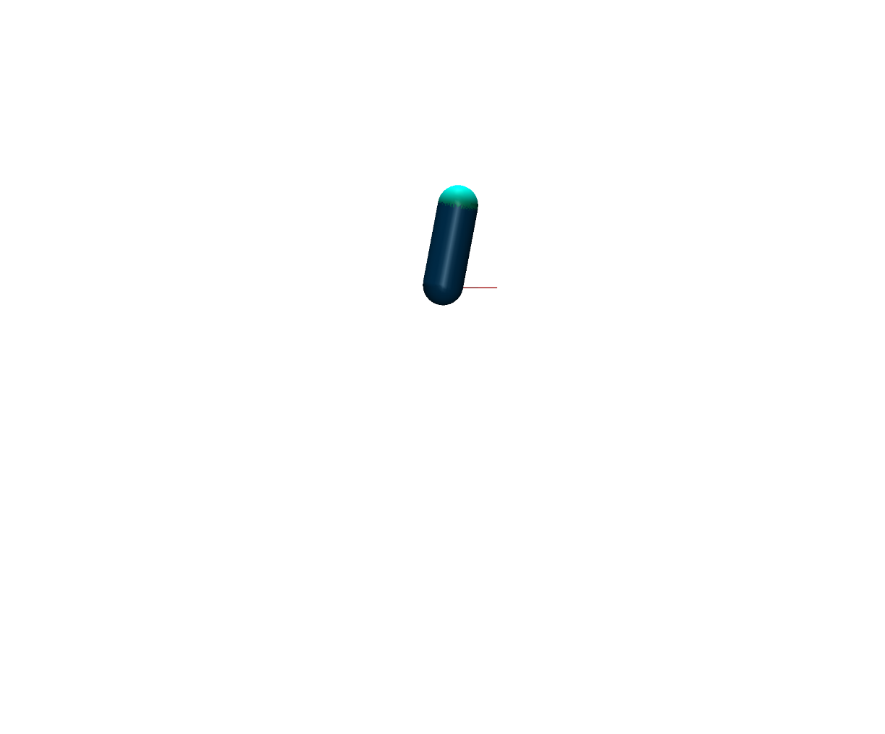
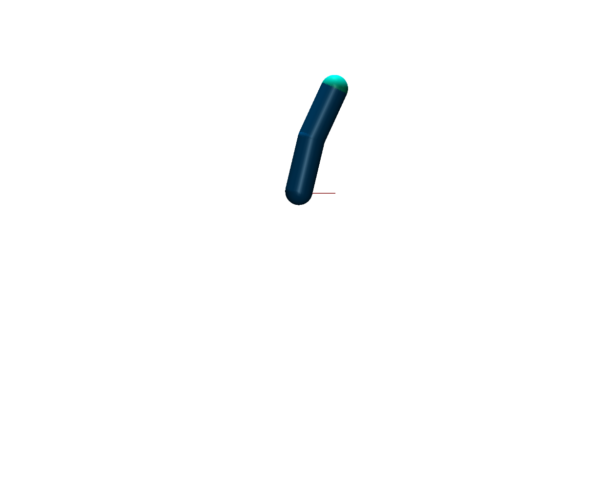
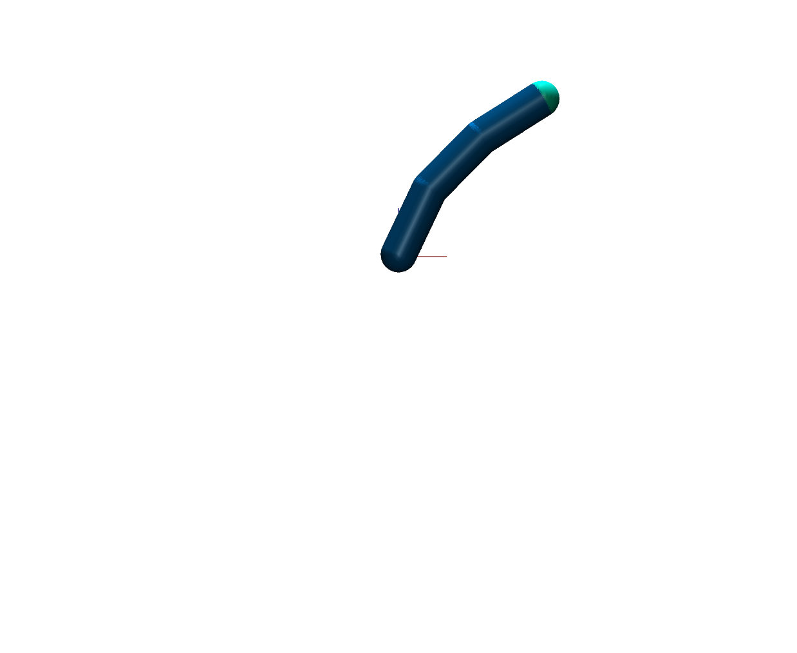
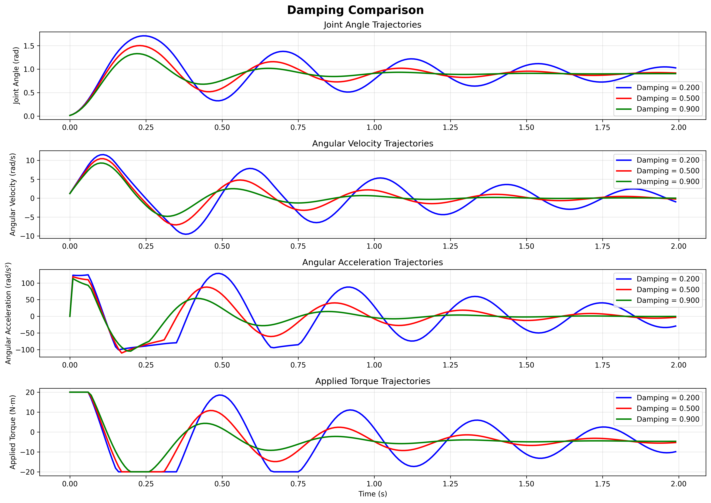

# MuJoCo Modular Robotic Simulation Framework

## 1. Introduction

This project presents a modular MuJoCo-based simulation framework designed for n-link robotic manipulator analysis. The system automatically generates and configures robotic chains with variable link counts, enabling systematic study of multi-joint dynamics and control strategies.

The framework's key strength lies in its **modular architecture** that can automatically instantiate robotic manipulators ranging from simple single-link pendulums to complex multi-link chains, all while maintaining consistent physics modeling and control interfaces. The goal is to provide a compute effective method for generating trajectories for a modular robot design architecture, such that the GNN can learn with these trajectories. 

## 2. MuJoCo Simulation System

### 2.1 Modular N-Link Architecture

The simulation framework employs a **parametric design approach** that automatically constructs n-link robotic manipulators based on configuration parameters. This modular system allows to:

- **Scalable Design**: Automatically generate 1-link to n-link configurations
- **Parameter Studies**: Systematically analyze how damping, friction link count etc. affects the trajectory

<div align="center">
<table>
<tr>
<td align="center"><br><b>Single-Link Manipulator (1-DOF)</b></td>
<td align="center"><br><b>Two-Link Manipulator (2-DOF)</b></td>
<td align="center"><br><b>Three-Link Manipulator (3-DOF)</b></td>
</tr>
</table>
</div>


### 2.2 Parametric Design Apporach
With the model setup several parameters such as inertia, mass, damping, friciton, gear ratios, maximum applied torque can be defined.

### 2.3 Damping Effect Analysis
In the ater GNN our Goal was it to estimate the damping of the generated robot setup. To validate that a proper damping estimation is crucial for predicting the system response an identical physical 1-link simulaton was performed under varying damping parameters.

#### 2.3.1 Experimental Setup
The following specifications were used for the damping analysis:
**Physical Properties:**
- **Mass**: 3.0 kg (main link body)
- **Fingertip Mass**: 0.5 kg (end effector)
- **Link Length**: 0.3 m
- **Link Radius**: 0.075 m
- **Moment of Inertia**: 0.159 kg⋅m²

**Dynamic Parameters:**
- **Friction Coefficient**: 0.0 (frictionless joints)
- **Torque Limit**: 20.0 N⋅m (maximum actuator output)

**Simulation Configuration:**
- **Time Step (dt)**: 0.01 s
- **Gravity**: [0.0, 0.0, -9.81] m/s²
- **Solver**: Implicit integration method
- **Simulation Duration**: 200 steps (2.0 seconds)

**Control Parameters:**
- **Proportional Gain (Kp)**: 40.0
- **Derivative Gain (Kd)**: 0.1
- **Control Type**: PD Controller

#### 2.3.2 Results

The following figure illustrates how different damping values significantly influence the system's response and settling behavior:
<div align="center">
<table>
<tr>
<td align="center"><br><b>Damping Effect on 1-DOF Manipulator Trajectory</b></td>
</tr>
</table>
</div>
The trajectory comparison clearly demonstrates that:
- **Higher damping** results in more conservative, slower convergence with reduced overshoot
- **Lower damping** produces faster response but with increased oscillatory behavior
- **Intermediate damping** values provide balanced performance between speed and stability

#### 2.3.3 Data Generation Strategy

The Data Generation Pipeline used for this project can be split down into the following:

1. **Systematic Parameter Variation**: Generate varying trajectories the same physical setup (inertia, damping, etc.) with different initial conditions and PD controller values
2. **State Trajectory Recording**: Capture complete system state evolution (position, velocity, acceleration, torque)

### 2.4 Automatic Generation Pipeline

The system features an **automated XML generation pipeline** that:

1. **Parameter Input**: unique physical robot specification, varying controller and initial condition setup  
2. **XML Construction**: Automatically builds MuJoCo model description
3. **Mujoco Simulation**: Executes Simulations based on XML file and varying controller and initial condition setup 
4. **Data Logger**: Save the Trajectories and specifications as JSON files


**Code Architecture**:
```
Parameter Space → XML Generation → MuJoCo Engine → PD Control → Data Export
      ↓               ↓              ↓              ↓           ↓
   • n-links       • Dynamic      • Physics      • Torque    • JSON
   • Masses        • Geometry     • Integration  • Limits    • Metadata  
   • Damping       • Joints       • Constraints  • Tracking  • Trajectories
   • Controllers   • Actuators    • Rendering    • Response  • Parameters
```


### 3.0 Debugging

- **Flexible Render Modes**: Execute simulation in visual mode for trajectory inspection and physical plausibility validation, or headless mode for rapid automated testing and data generation
- **Accelerated Validation**: Speed up simulation playback to quickly assess trajectory behavior and validate parameter configurations across longer time horizons


### 4.Feature Work

#### 4.1 Intelligent Data Collection
- **Trajectory Quality Assessment**: Automatically evaluate data richness and truncate trajectories at steady-state
- **Richness Metrics**: Implement measures for state space coverage, frequency content, and control effort diversity

#### 4.2 Realistic Signal Modeling
- **Sensor Noise**: Add realistic jitter to position, velocity, and torque measurements
- **Communication Effects**: Include delays, sampling limitations, and actuator response characteristics
- **Signal Processing**: Model discrete-time effects and filtering artifacts

#### 4.3 Advanced Physical Models
- **Enhanced Damping**: Non-linear damping models
- **Comprehensive Friction**: Stiction, Stribeck Model
- **Gear Train Effects**: Backlash

#### 4.4 Data Pipeline Improvements
- **Active Learning**: Intelligent parameter space exploration
- **Real-time Monitoring**: Online trajectory quality assessment


# Example Equation
This is an example on how to implelment Equations in Markdown
$I = \frac{1}{12}m(3r^2 + L^2)$ where $m$ is mass, $r$ is radius, and $L$ is length.


